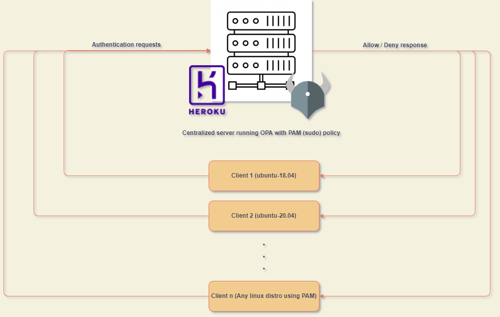
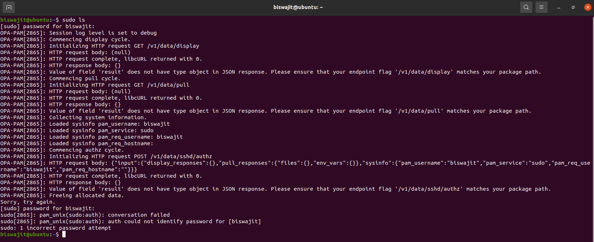

# OPA Linux PAM  - Sudo authorization

The repository aims at reproduces the [SSH and sudo authorization](https://www.openpolicyagent.org/docs/latest/ssh-and-sudo-authorization/) setup. However, instead of spinning up docker containers to execute the `ssh` and `sudo` instructions, it performs the `sudo` authorization on a linux setup running as the pipeline agent on Github workflows.

## What do you need to understand this repository?

1. [Open Policy Agent](https://www.openpolicyagent.org/)
2. An understanding of Linux & [Linux PAM](https://www.linuxfromscratch.org/blfs/view/svn/postlfs/linux-pam.html)
3. Github workflows

## Architecture

The solution consists of two services: **client** and a **server**. The server is located at the URL: http://opa-auth-server.herokuapp.com/ and is running an opa server with the [sudo policy](https://github.com/Biswajee/heroku-opa-server/tree/master/policy).

## Execution and authorization resolution

Whenever an opa configured system runs a `sudo` command, the OPA PAM Client connects to the OPA Server for authorization. The successful execution of the `sudo` command in the client depends upon the outcome of the policy evaluation.

## Reproducing the setup

All steps and configuration to reproduce the OPA PAM Setup on the Github pipeline can be found [here](.github/workflows/vanilla-build-pipeline.yml). Explanations of each step can be found in the comments.

## Exemplary outcomes

1. Local Setup (Ubuntu-20.04)
  

2. Pipeline setup (Ubuntu-20.04) [HERE](https://github.com/Biswajee/opa-linux-pam/runs/4632295105?check_suite_focus=true#step:9:31)
  

## Additional references

Please checkout the repository that spins up the remote authentication server [here](https://github.com/Biswajee/heroku-opa-server).

_The setup is a POC only and contains several security loopholes. Please do not use it for production._  
